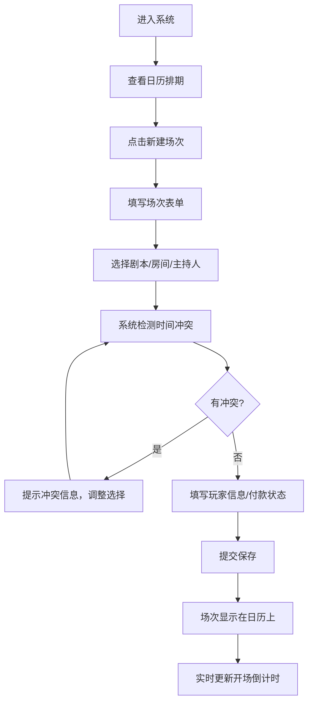

## 1. 产品概述

本产品是面向小型剧本杀门店的场次编排管理系统，通过数字化方式管理剧本、房间、主持人资源，并提供直观的日历视图进行场次预约和排期管理，有效避免资源冲突，提升门店运营效率。

- 核心目标：解决剧本杀门店场次编排混乱、资源冲突难管理的痛点
- 目标用户：剧本杀门店店主、前台接待、场次管理员
- 产品价值：减少人工排期错误，提高资源利用率，提升门店运营效率

## 2. 核心功能

### 2.1 用户角色

| 角色 | 注册方式 | 核心权限 |
|------|----------|----------|
| 门店管理员 | 本地登录 | 全功能权限，包括剧本、房间、主持人管理，场次编排，数据查看 |

### 2.2 功能模块

1. **仪表盘/日历视图**：当天排期概览、日历导航、场次卡片展示
2. **剧本管理**：剧本列表、新增/编辑/删除剧本、剧本信息维护
3. **房间管理**：房间列表、新增/编辑/删除房间、房间容量和设施管理
4. **主持人管理**：主持人列表、新增/编辑/删除主持人、档期管理
5. **场次管理**：场次创建/编辑/取消、冲突检测、玩家人数管理、付款状态跟踪、开场倒计时

### 2.3 页面详情

| 页面名称 | 模块名称 | 功能描述 |
|-----------|-------------|---------------------|
| 日历排期页 | 顶部导航栏 | 页面切换、日期选择器、新建场次按钮 |
| 日历排期页 | 日历视图 | 月/周/日视图切换、时间轴展示、场次卡片拖拽 |
| 日历排期页 | 场次卡片 | 显示剧本名称、房间、主持人、玩家人数、付款状态、开场倒计时 |
| 剧本管理页 | 剧本列表 | 剧本卡片展示、搜索筛选、增删改操作 |
| 房间管理页 | 房间列表 | 房间卡片展示、容量信息、状态标识 |
| 主持人管理页 | 主持人列表 | 主持人信息、联系方式、档期状态 |
| 场次表单弹窗 | 基础信息 | 选择剧本、房间、主持人、设置开场时间 |
| 场次表单弹窗 | 玩家信息 | 玩家人数、已付/未付金额标记 |
| 场次表单弹窗 | 冲突检测 | 实时检测房间、主持人、剧本时间冲突并提示 |

## 3. 核心流程

### 主业务流程

用户进入系统后，首先看到日历视图展示当天及未来的排期。用户可以：
1. 查看已有场次的详细信息（点击卡片）
2. 创建新场次（点击新建按钮，弹出表单）
3. 在表单中选择剧本、房间、主持人，设置时间
4. 系统实时检测资源冲突，如有冲突给出提示
5. 填写玩家人数和付款状态
6. 提交保存，场次显示在日历上
7. 场次卡片实时显示开场倒计时

## 4. 用户界面设计

### 4.1 设计风格

- **主色调**：深靛蓝色系（#1e1b4b）作为主色，营造神秘悬疑氛围，符合剧本杀主题
- **辅助色**：金色（#f59e0b）用于强调和重要操作按钮，紫色（#8b5cf6）用于状态标识
- **中性色**：深灰背景（#0f172a），浅灰文字，高对比度确保可读性
- **按钮风格**：圆角矩形，带微妙的渐变和悬停动画，点击有按压效果
- **字体**：展示字体使用 Noto Serif SC（衬线体，增加神秘感），正文字体使用 Noto Sans SC
- **布局风格**：卡片式布局，深色主题，微妙的光影效果，层次分明
- **图标风格**：lucide-react 线性图标，统一 24px 尺寸，线条圆润

### 4.2 页面设计概述

| 页面名称 | 模块名称 | UI元素 |
|-----------|-------------|-------------|
| 日历排期页 | 导航栏 | 深色导航栏，品牌Logo，页面切换标签，日期选择器，主操作按钮 |
| 日历排期页 | 侧边栏 | 当天场次概览，快捷统计数据（今日场次、待开场、已完成） |
| 日历排期页 | 日历主体 | 时间轴网格，场次彩色卡片，悬停效果，点击展开详情 |
| 管理列表页 | 顶部操作区 | 搜索框，筛选按钮，新增按钮 |
| 管理列表页 | 卡片网格 | 信息卡片，悬停高亮，操作按钮组 |
| 场次表单弹窗 | 弹窗容器 | 半透明背景模糊，居中弹窗，平滑进入动画 |
| 场次表单弹窗 | 表单区域 | 分组标签，下拉选择器，时间选择器，冲突提示红色警示 |
| 场次卡片 | 信息展示 | 剧本名称大号字体，房间/主持人小字，玩家人数徽章，付款状态标签，倒计时计时器 |

### 4.3 响应式

- 采用桌面优先设计，主操作区域固定宽度 1440px
- 中等屏幕（1024px-1440px）自适应调整卡片间距和尺寸
- 平板及以下设备折叠侧边栏，切换为单列布局
- 触摸操作优化：按钮最小尺寸 44x44px，点击区域充足

### 4.4 动效设计

- 页面加载：元素淡入上移，错开延迟营造层次感
- 场次卡片：悬停时轻微上浮，阴影加深
- 弹窗：背景模糊渐变，弹窗从中心缩放出现
- 倒计时：数字变化时有平滑过渡动画
- 冲突提示：红色边框脉动动画，吸引注意力
