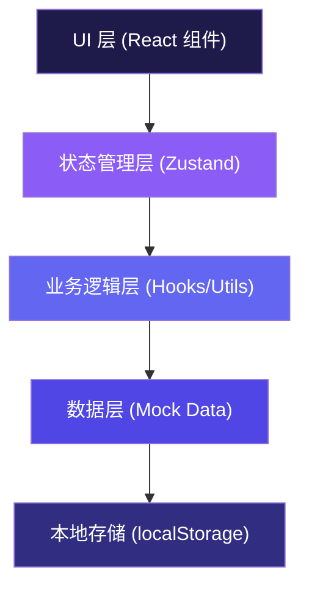
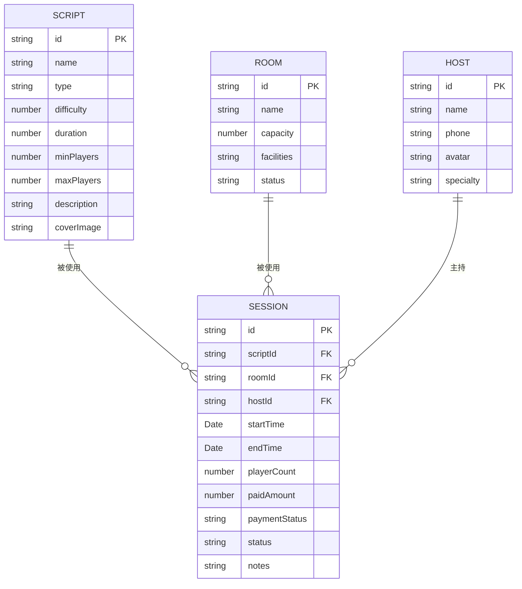

## 1. 架构设计

本项目为纯前端单页应用（SPA），采用分层架构设计，数据存储使用本地模拟数据配合 zustand 状态管理。



## 2. 技术描述

- **前端框架**：React@18 + TypeScript
- **构建工具**：Vite@5
- **样式方案**：TailwindCSS@3 + CSS 变量
- **状态管理**：Zustand@4
- **路由管理**：React Router DOM@6
- **图标库**：Lucide React
- **日期处理**：date-fns
- **数据持久化**：localStorage
- **后端**：无（纯前端模拟数据版本）

## 3. 路由定义

| 路由 | 页面名称 | 用途 |
|-------|---------|------|
| / | 日历排期页 | 主页面，展示日历视图和场次排期 |
| /scripts | 剧本管理页 | 剧本信息的增删改查 |
| /rooms | 房间管理页 | 房间信息的增删改查 |
| /hosts | 主持人管理页 | 主持人信息的增删改查 |

## 4. 数据模型

### 4.1 实体关系图



### 4.2 类型定义

```typescript
// 剧本
interface Script {
  id: string;
  name: string;
  type: '恐怖' | '情感' | '推理' | '欢乐' | '阵营' | '其他';
  difficulty: 1 | 2 | 3 | 4 | 5;
  duration: number; // 分钟
  minPlayers: number;
  maxPlayers: number;
  description: string;
  coverImage?: string;
}

// 房间
interface Room {
  id: string;
  name: string;
  capacity: number;
  facilities: string[];
  status: 'available' | 'maintenance' | 'disabled';
}

// 主持人
interface Host {
  id: string;
  name: string;
  phone: string;
  avatar?: string;
  specialty: string[];
}

// 场次
interface Session {
  id: string;
  scriptId: string;
  roomId: string;
  hostId: string;
  startTime: string; // ISO string
  endTime: string;   // ISO string
  playerCount: number;
  paidAmount: number;
  paymentStatus: 'unpaid' | 'partial' | 'paid';
  status: 'scheduled' | 'ongoing' | 'completed' | 'cancelled';
  notes?: string;
}

// 冲突检测结果
interface ConflictResult {
  hasConflict: boolean;
  conflicts: {
    type: 'room' | 'host' | 'script';
    message: string;
    conflictingSession?: Session;
  }[];
}
```

## 5. 项目结构

```
src/
├── components/          # 可复用组件
│   ├── layout/         # 布局组件
│   │   ├── Navbar.tsx
│   │   ├── Sidebar.tsx
│   │   └── PageLayout.tsx
│   ├── calendar/       # 日历相关组件
│   │   ├── CalendarView.tsx
│   │   ├── TimeGrid.tsx
│   │   └── SessionCard.tsx
│   ├── session/        # 场次相关组件
│   │   ├── SessionForm.tsx
│   │   ├── SessionModal.tsx
│   │   └── CountdownTimer.tsx
│   ├── management/     # 管理类组件
│   │   ├── ScriptCard.tsx
│   │   ├── RoomCard.tsx
│   │   └── HostCard.tsx
│   └── ui/             # 基础UI组件
│       ├── Button.tsx
│       ├── Input.tsx
│       ├── Select.tsx
│       ├── Modal.tsx
│       └── Badge.tsx
├── pages/              # 页面组件
│   ├── Calendar.tsx
│   ├── Scripts.tsx
│   ├── Rooms.tsx
│   └── Hosts.tsx
├── store/              # Zustand 状态管理
│   ├── useScriptStore.ts
│   ├── useRoomStore.ts
│   ├── useHostStore.ts
│   └── useSessionStore.ts
├── hooks/              # 自定义 Hooks
│   ├── useConflictDetection.ts
│   ├── useCountdown.ts
│   └── useLocalStorage.ts
├── data/               # 模拟数据
│   ├── mockScripts.ts
│   ├── mockRooms.ts
│   ├── mockHosts.ts
│   └── mockSessions.ts
├── types/              # TypeScript 类型定义
│   └── index.ts
├── utils/              # 工具函数
│   ├── dateUtils.ts
│   ├── conflictUtils.ts
│   └── formatUtils.ts
├── App.tsx
├── main.tsx
└── index.css
```

## 6. 核心功能实现方案

### 6.1 冲突检测算法

1. 对于新场次，获取其开始时间和结束时间（开始时间 + 剧本时长）
2. 遍历所有已有场次，检查三种冲突：
   - **房间冲突**：同一房间在时间段内已有场次
   - **主持人冲突**：同一主持人在时间段内已有场次
   - **剧本冲突**：同一剧本（特殊限定本）在时间段内已有场次
3. 时间重叠判断逻辑：
   ```
   重叠条件：newStart < existingEnd AND newEnd > existingStart
   ```
4. 返回所有冲突信息，在表单中实时展示

### 6.2 开场倒计时实现

1. 使用自定义 `useCountdown` Hook
2. 计算当前时间与开场时间的差值
3. 每秒更新一次倒计时显示
4. 根据剩余时间显示不同状态颜色：
   - > 24小时：正常色
   - 1-24小时：黄色警告
   - < 1小时：红色紧急
   - 已开场：进行中状态

### 6.3 状态管理设计

每个实体（剧本、房间、主持人、场次）独立创建一个 Zustand store，包含：
- 数据列表
- CRUD 操作方法
- 筛选/搜索方法
- 本地存储持久化
